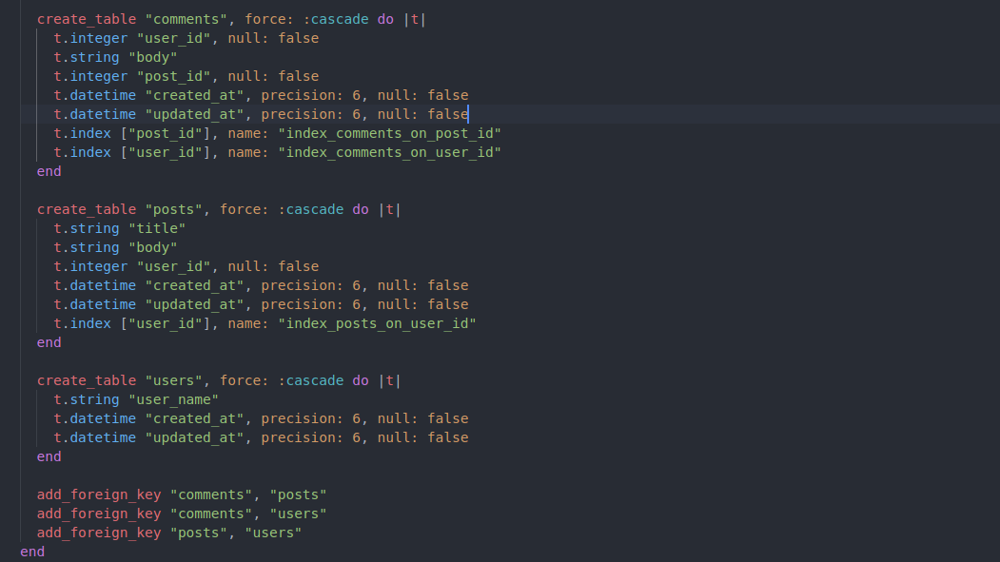

# Micro-Reddit

  This is a model build with rails where users can create posts and comment on their post and that of other users using the rails console.
  
### Screenshots

## Prerequisties

You need to have Ruby and Ruby on Rails installed in your machine.

## Getting Started

To get a local copy up and running follow these simple example steps:

- Open your terminal
- Clone this project into the directory of your choice `git clone https://github.com/AymenBida/Micro-reddit.git`
- Go to the project folder `cd Micro-reddit`

### Install

- Run `bundle install`
- Migrate de database `rails db:migrate`

### Run tests

- Run `rails c` or `rails console`
- You will be able interact with the migration tables generated by the model:

    - You can create and save a new user using this command:
      `User.create(user_name: "<your user name here>")`
    - You can create and save a new post using this command:
      `Post.create(title: "<your title here>", body: "<your content here>", user_id: <id of the user who wrote the post>)`
    - You can create and save a new comment using this command:
      `Comment.create(user_id: <id of the user who wrote the comment>, body: "<your comment here>", post_id: <id of the commented post>)`
    
### :hammer: Built With

* Ruby
* Rails
* Rubocop

## Authors

👤 **Ahmet Bozacı**
- Github:[@ahmtbozaci](https://github.com/ahmetbozaci)
- Twitter:[@ahmtbozaci](https://twitter.com/ahmtbozaci)
- LinkedIn:[@ahmtbozaci](https://www.linkedin.com/in/ahmetbozaci/)

👤 **Aymen Bida**

- GitHub: [@AymenBida](https://github.com/AymenBida)
- Twitter: [@AymenBida](https://twitter.com/AymenBida)
- LinkedIn: [AymenBida](https://www.linkedin.com/in/aymenbida/)

## 🤝 Contributing

Contributions, issues and feature requests are welcome!

Feel free to check the [issues page](https://github.com/AymenBida/Micro-reddit/issues)

## 📝 License

Copyright 2021 Aymen Bida and Ahmet Bozacı

Permission is hereby granted, free of charge, to any person obtaining a copy of this software and associated documentation files (the "Software"), to deal in the Software without restriction, including without limitation the rights to use, copy, modify, merge, publish, distribute, sublicense, and/or sell copies of the Software, and to permit persons to whom the Software is furnished to do so, subject to the following conditions:

The above copyright notice and this permission notice shall be included in all copies or substantial portions of the Software.

THE SOFTWARE IS PROVIDED "AS IS", WITHOUT WARRANTY OF ANY KIND, EXPRESS OR IMPLIED, INCLUDING BUT NOT LIMITED TO THE WARRANTIES OF MERCHANTABILITY, FITNESS FOR A PARTICULAR PURPOSE AND NONINFRINGEMENT. IN NO EVENT SHALL THE AUTHORS OR COPYRIGHT HOLDERS BE LIABLE FOR ANY CLAIM, DAMAGES OR OTHER LIABILITY, WHETHER IN AN ACTION OF CONTRACT, TORT OR OTHERWISE, ARISING FROM, OUT OF OR IN CONNECTION WITH THE SOFTWARE OR THE USE OR OTHER DEALINGS IN THE SOFTWARE.

### Credits

The project is part of Microverse Technical curriculum - Ruby on Rails section

## Show your support

Give a ⭐️ if you like this project!
